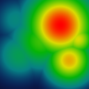

# WiFi Heatmap

A macOS app for mapping WiFi signal coverage. Import a floor plan, walk around your space with your Mac, tap to log readings, and watch a signal strength heatmap build up in real time.



## What it does

WiFi Heatmap turns your MacBook into a survey instrument. You load a floor plan, set a scale reference, then walk to different spots in your space and tap the corresponding location on the map. The app records the WiFi signal at each point and interpolates a smooth heatmap across the floor plan showing where signal is strong, weak, or absent.

Useful for:
- Finding dead zones before placing a mesh node or extender
- Verifying coverage after adding or repositioning an access point
- Documenting signal quality across a floor for reporting or troubleshooting
- Comparing per-band coverage (2.4 / 5 / 6 GHz) on the same floor plan

## Requirements

- macOS 14 (Sonoma) or later
- [Xcode 16](https://developer.apple.com/xcode/) or later
- [xcodegen](https://github.com/yonaskolb/XcodeGen) (`brew install xcodegen`)
- Location Services permission — Apple requires this to read access point BSSIDs from CoreWLAN

## Building

```bash
git clone git@github.com:tasercake/wifiheatmap.git
cd wifiheatmap
xcodegen generate
open WifiHeatmap.xcodeproj
```

Press **⌘R** to build and run, or build from the command line:

```bash
xcodebuild -scheme WifiHeatmap -configuration Debug build
```

On first launch, macOS will ask for Location Services permission. Grant it — without it the app cannot read BSSID information from nearby networks.

## Usage

### 1. Create a document

**File > New** creates a new WiFi survey document (`.wifiheatmap`). These are directory bundles that store the floor plan image and all logged readings together.

### 2. Add a floor

Click the **+** tab in the tab bar at the top of the window to add a floor. You can add as many floors as your building has. Click a tab to switch between floors; right-click a tab to rename or delete it.

### 3. Import a floor plan

Open the inspector panel (the **⊞** button, top-right of the window) and click **Import Floor Plan…** at the bottom. Supported formats: PNG, JPEG, PDF. A clean architectural drawing or even a hand-sketched layout works fine — anything with recognizable room boundaries.

### 4. Calibrate the scale

Before logging readings, the app needs to know the real-world scale of your floor plan. In the inspector, turn on **Calibration Mode**. Two crosshairs appear on the floor plan — drag them to two points whose real-world distance you know (e.g. the ends of a hallway you have measured). Enter the distance when prompted. Turn Calibration Mode off when done.

Calibration is required for the fade radius to reflect meters accurately. Without it the heatmap will still render, but the signal falloff distances will be wrong.

### 5. Log readings

Make sure your Mac is connected to (or can see) the WiFi network you want to map. The scanner stays idle until you click the calibrated floor plan; the inspector's **Status** indicator shows when that explicit scan is running.

Walk to a location in your space, then click the corresponding spot on the floor plan. The app starts a new serialized CoreWLAN scan and shows its attempt number in the bottom-right status card. A marker is added only after one scan batch contains every required network, access point, and tracked band; if all four attempts fail, the status card explains that no point was added. Results from different attempts are never combined. Repeat across the space — more readings produce a more accurate heatmap. Aim for one reading every 3–5 meters.

The app records scan start/end times, listens for CoreWLAN's scan-cache update event, and compares the complete BSSID/RSSI/noise snapshot with the previous scan. It retries potentially cached results (an unusually fast, unchanged response with no cache-update event), recoverable scan failures, missing selections, and incomplete tracked-band coverage, with bounded delays between up to four attempts. A successful marker is labeled **New CoreWLAN scan completed**; this confirms a completed API call without claiming radio-level freshness.

**Tips:**
- Use the **Band** picker to choose which recorded band is displayed.
- Under **Track Bands**, uncheck bands you do not need. Disabled bands are not required or stored in future points; existing data is unchanged.
- Use **Networks** and **Access Points** to select any number of required values. Empty selection means **All**. These selections also filter displayed points and the heatmap.
- The bottom-right status card shows scan progress, failures, and the signal used for the last successfully recorded point.

### 6. View the heatmap

Toggle **Show Heatmap** in the inspector. The heatmap renders immediately from your logged readings using inverse-distance weighting interpolation.

Toggle **Show Contours** to add labeled signal isolines over the floor plan. RSSI and SNR contours target 10 dB steps; the app automatically suppresses crowded lines when adjacent levels would be less than roughly 0.75 metres apart on the calibrated plan. The **Smoothing** slider applies up to 3 metres of calibration-aware smoothing to the contour field, reducing bumps around individual readings without changing the readings or heatmap. Contours follow the active band and SSID/AP filters. They are unavailable for the categorical Channel metric.

#### Metrics

| Metric | What it shows |
|--------|--------------|
| **RSSI** | Raw received signal strength in dBm. Higher (less negative) is stronger. Range: −90 to −50 dBm. |
| **SNR** | Signal-to-noise ratio in dB. Measures connection quality independent of raw power. Range: 0 to 40 dB. |
| **Channel** | The WiFi channel dominating each area, color-coded by channel number. Useful for identifying interference between overlapping networks. |

#### Color schemes

| Scheme | Description |
|--------|-------------|
| Red → Blue | Red for weak signal, blue for strong. |
| Red → Green | Traffic-light convention: red = poor, green = good. |
| Colorblind Safe | Blue and orange palette, readable for deuteranopia and protanopia. |

The **Fade Radius** slider controls how far each reading's influence spreads in meters. Increase it to smooth over sparse readings; decrease it to show sharp transitions between measurement points.

A **legend** appears at the bottom of the inspector when the heatmap is active.

### 7. Filter by access point

If multiple access points share an SSID (common in mesh networks), use the **Access Points** menu to select one or more BSSIDs and compare their combined coverage. Selected APs must appear in a successful capture on their own tracked band; an AP is never required to appear across every band.

### 8. Delete readings

To remove a misplaced reading, enable **Delete Mode** in the inspector, then click the marker on the map. You can also right-click any marker at any time for a context menu with a delete option. Delete and add operations support full **undo/redo** (⌘Z / ⇧⌘Z).

### 9. Export

Click **Export as PNG…** in the inspector to save the floor plan with its floor name and metric legend. Enabled heatmap and contour layers are composited into the export; either visual layer can be shown independently.

## Project structure

```
WifiHeatmap/
├── Models/          # Data types: WifiSurvey, Floor, WifiSample, ScannedNetwork
├── Heatmap/         # IDW interpolation, rendering, color schemes, metrics
├── Scanning/        # CoreWLAN wrapper (ScanActor)
├── Views/           # SwiftUI views
│   ├── ContentView.swift       # Document root, floor tab bar
│   ├── FloorTabBar.swift       # Tab bar + inspector toggle
│   ├── FloorDetailView.swift   # Map area + inspector layout
│   ├── FloorPlanView.swift     # Floor plan + heatmap canvas + markers
│   ├── InspectorView.swift     # All controls (band, metric, calibration, etc.)
│   └── HeatmapLegendView.swift # Color scale legend overlay
└── Assets.xcassets/
```

The document format is a directory bundle (`.wifiheatmap`). Floor plan images are stored as PNGs inside the bundle alongside a JSON file containing all survey data.
